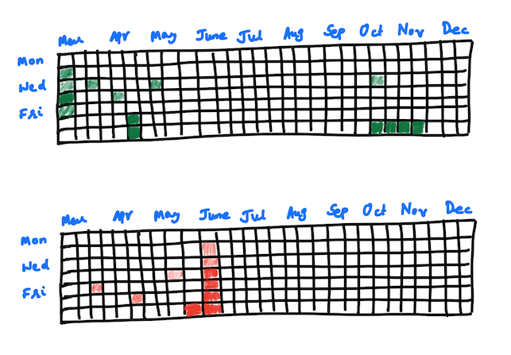

# activity-graph-component

A design component to reproduce creating the github style commit graph for instant visual feedback.

## Example



## Features

- Easy data passing format to populate activity frequency
- Rolling time scale
- Responsive layout
- Ability to change commit frequency colors
- Embed anywhere
- Plugins for applications
- Pluggable backend database for persistent storage

## Data format

### Stateless

```json
{
    "storage": false,
    "data": [
        "2024-02-28": 2,
        "2024-02-29": 4,
        "2024-03-01": 17,
        "2024-03-02": 0,
        "2024-03-03": 1,
    ]
}
```

### Stateful

```json
{
    "storage": true,
    "data": [
        "2024-03-03": 1,
    ]
}
```

## TODOs
